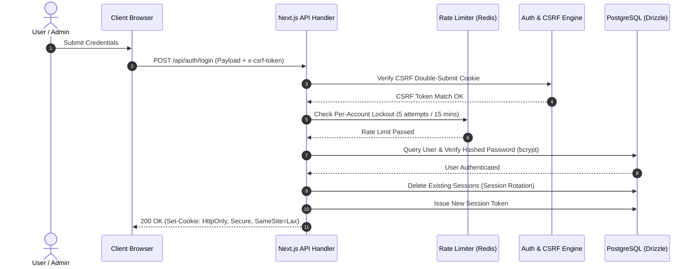

 this erro

# SheroTech — System & Security Architecture

> **Purpose**: A comprehensive reference detailing the technical architecture, data layer, security parameters, state management model, and design system of the SheroTech showcase platform.

---

## 1. Executive Summary & Core Philosophy

SheroTech is built around a unified full-stack architecture powered by Next.js 16+ App Router, React 19, Tailwind CSS v4, and PostgreSQL via Drizzle ORM.

Our architectural choices are driven by four core principles:

* **Purpose & Intent**: Every technical layer exists to provide reliable performance, accessibility, and high developer velocity without unnecessary overhead.
* **Security by Design**: Native defense-in-depth mechanisms, including session rotation, account lockouts, double-submit cookie CSRF protection, and TOTP-based Multi-Factor Authentication.
* **Data Integrity**: Unified database operations exclusively managed via Drizzle ORM to eliminate raw SQL vulnerabilities and maintain strict type safety across the application.
* **Component Modularity**: Strict adherence to component decomposition standards (no component file exceeds 300 lines), maintaining readability and ease of maintenance.

---

## 2. High-Level System Architecture

```mermaid
graph TD
    Client["Client Browser (React 19 + motion)"]
    NextServer["Next.js Server (App Router Native Architecture)"]
    AuthModule["Auth & Security Engine (CSRF, Rate Limiter, MFA)"]
    DrizzleORM["Drizzle ORM Data Layer"]
    PostgreSQL["PostgreSQL Database (Supabase)"]
    Redis["Upstash Redis (Rate Limiting)"]
    Hubtel["Hubtel Payment Gateway"]

    Client -->|HTTPS / REST API| NextServer
    NextServer --> AuthModule
    AuthModule -->|Token Checks / Lockout| Redis
    NextServer --> DrizzleORM
    DrizzleORM -->|Parameterized Queries| PostgreSQL
    NextServer -->|Payment Webhooks & Verification| Hubtel
```



---

## 3. Technology Stack Breakdown

| Layer                        | Technology                    | Primary Role                                                     |
| ---------------------------- | ----------------------------- | ---------------------------------------------------------------- |
| **Framework**          | Next.js 16+ (App Router)      | Full-stack server and client rendering, native API routes        |
| **Language**           | TypeScript 5.9                | End-to-end static typing across UI components and API handlers   |
| **UI Library**         | React 19                      | Server & Client Components, modern hooks, form handling          |
| **Styling**            | Tailwind CSS v4 + Vanilla CSS | Utility-first design tokens, OKLCH dual-primary system           |
| **Animations**         | `motion` (Framer Motion)    | Hardware-accelerated UI transitions and micro-interactions       |
| **Data Layer**         | Drizzle ORM 0.45+             | Strongly typed database queries, transactions, schema migrations |
| **Database**           | PostgreSQL                    | Relational data persistence hosted on Supabase                   |
| **Cache & Rate Limit** | Upstash Redis                 | Per-IP and per-account distributed rate limiting                 |
| **Testing**            | Vitest & Playwright           | Unit testing for utilities/APIs and end-to-end user flow specs   |

---

## 4. Data Layer Architecture

All database interactions flow through Drizzle ORM (`src/lib/db.ts` and `src/lib/drizzle/schema.ts`). Raw SQL queries (`query()`) are decommissioned across all server routes.

### Key Schema Entities (`src/lib/drizzle/schema.ts`)

* **`users` / `adminUsers`**: Core account identities for public users and system administrators.
* **`userSessions` / `sessions`**: Active session records with support for session rotation on login.
* **`products`**: Tech solutions, hardware catalog items, category attributes, and inventory levels.
* **`orders` / `orderItems`**: E-commerce orders, pricing breakdown, fulfillment status, and tracking tokens.
* **`paymentLogs`**: Transaction records tracking Hubtel payment attempts, statuses, and webhooks.
* **`consultations` / `supportTickets`**: Client service requests and technical support threads.
* **`whatsappMessages` / `whatsappConversations`**: Automated and agent-driven WhatsApp client engagement.

### Database Query Pattern

```typescript
import { db } from "@/lib/db";
import { products } from "@/lib/drizzle/schema";
import { eq, and, desc } from "drizzle-orm";

// Single-source parameterized query via Drizzle
const activeProducts = await db
  .select()
  .from(products)
  .where(and(eq(products.inStock, true), eq(products.category, category)))
  .orderBy(desc(products.createdAt));
```

---

## 5. Security & Authentication Architecture

SheroTech enforces defense-in-depth security principles across all client and administrative entry points.



### Core Security Controls

1. **Session Rotation**: On successful authentication, all existing active session tokens for the authenticating identity are deleted before a fresh session token is issued, mitigating session hijacking.
2. **Account Lockout Protection**: Rate limiting is configured per IP address and per target account (`account_login_{email}`). Exceeding 5 failed attempts locks login for 15 minutes.
3. **Double-Submit Cookie CSRF Protection**: State-changing requests (`POST`, `PUT`, `DELETE`) require an `x-csrf-token` request header matching the non-httpOnly `shero_csrf` cookie value (`src/lib/csrf.ts`).
4. **Input Sanitization**: User input strings are sanitized via `src/lib/sanitize.ts` (`sanitizeText`, `canonicalizeEmail`, `sanitizePhone`) to eliminate XSS vectors and normalize lookup keys.
5. **Security Headers**: Standard headers configured in `next.config.ts`:
   * `X-Frame-Options: DENY`
   * `X-Content-Type-Options: nosniff`
   * `Referrer-Policy: strict-origin-when-cross-origin`
   * `Permissions-Policy: camera=(), microphone=(), geolocation=()`
   * `Strict-Transport-Security: max-age=31536000; includeSubDomains; preload`

---

## 6. State Management Model

SheroTech decouples client state from server state to minimize unnecessary component re-renders:

* **Server State**: Managed exclusively by `@tanstack/react-query` (`src/hooks/queries/`). Handles network caching, revalidation on window focus, optimistic updates, and loading states.
* **Client UI State**: Managed via scoped React Hooks and lightweight contexts (`ThemeContext`, `DialogContext`).
* **Cart State**: Hybrid persistence using local storage for instantaneous feedback alongside debounced background synchronization with server endpoints (`CartContext`).

---

## 7. Design System & Aesthetics

Our design philosophy communicates confidence, clarity, and innovation.

### Dual-Primary Color System

SheroTech intentionally combines two primary color accents to balance trustworthiness with dynamic growth:

* **Navy Blue (`--primary` / `#043284`)**: Reflects authority, enterprise stability, and brand foundation. Used for primary CTAs, active navigation items, structural headers, and focus states.
* **Emerald Green (`--brand-secondary` / `#10b981`)**: Reflects innovation, successful outcomes, and system health. Used for active badges, progress bars, success state indicators, and dynamic accents.

### UI Tokens & Dark Mode

* All colors reference CSS variables defined in `src/index.css`.
* Raw hardcoded colors (e.g., `bg-slate-900`, `text-white`) in component logic are replaced with semantic CSS variables (`bg-card`, `text-foreground`, `border-border`, `bg-muted`).
* Dark mode flash prevention is implemented inline within `ThemeContext` before DOM paint.

---

## 8. Directory Organization

```
sherotech/
├── docs/                      # Architectural, UI, and security documentation
├── src/
│   ├── app/                   # Next.js App Router routes & API endpoints
│   ├── components/            # Reusable UI sub-components (strictly <= 300 lines)
│   ├── context/               # Light client UI state contexts
│   ├── hooks/                 # Custom React hooks & React Query wrappers
│   ├── lib/                   # Drizzle ORM, auth, rate limiting, and utilities
│   ├── services/              # Client API fetchers
│   ├── types/                 # Shared TypeScript interface definitions
│   ├── utils/                 # Pure helper functions
│   └── views/                 # Top-level page views and orchestrators
├── tests/                     # Playwright E2E test specs
└── scripts/                   # Migration & build utility scripts
```
