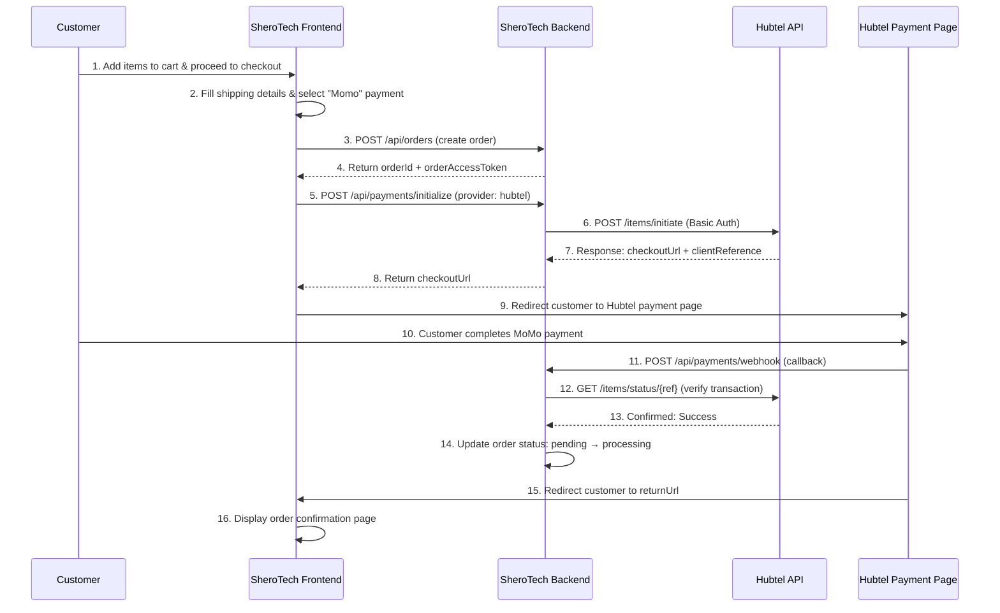
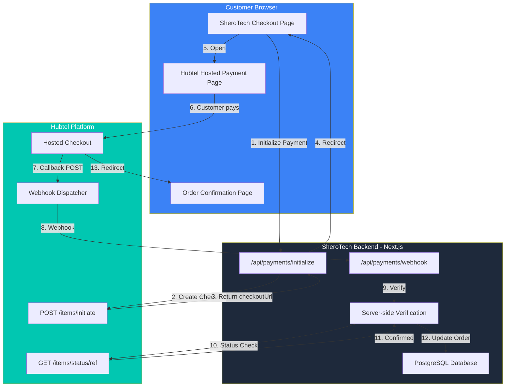
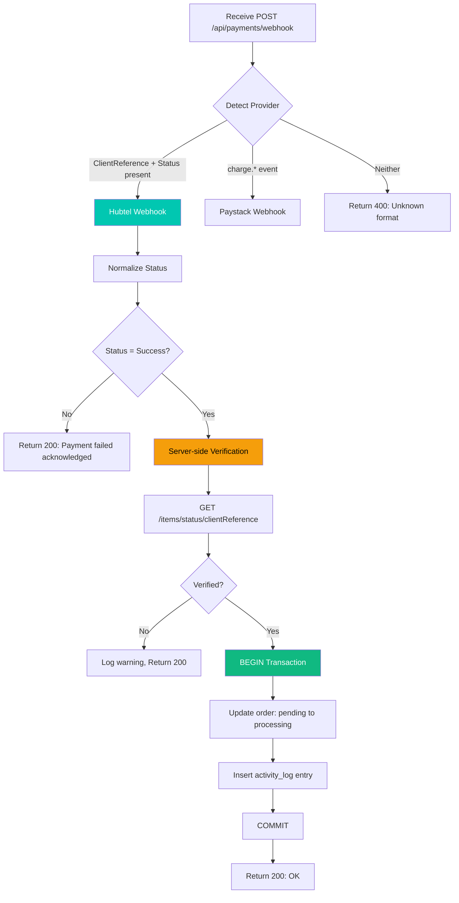

# SheroTech × Hubtel — API Integration Flow & UAT Documentation

**Prepared by**: SHERO HQ Technologies  
**Date**: July 2026  
**Integration**: Hubtel Online Checkout (Hosted Payment Page)  
**Platform**: https://sherohq.com  

---

## 1. Integration Overview

SheroTech integrates with Hubtel's **Online Checkout API** to process **mobile money (MoMo)** payments for hardware, accessories, and IT services purchased through the SheroTech e-commerce platform.

| Component | Details |
|---|---|
| **API Product** | Online Checkout (Hosted Payment Page) |
| **Payment Methods** | MTN Mobile Money, Telecel Cash |
| **Currency** | GHS (Ghana Cedis) |
| **Authentication** | HTTP Basic Auth (Client ID + Client Secret) |
| **Checkout Type** | Redirect to Hubtel hosted payment page |
| **Webhook** | Server-to-server callback with server-side verification |

---

## 2. Predesigned Flow — How SheroTech Interfaces with Hubtel APIs

### 2.1 End-to-End Payment Flow



### 2.2 System Architecture



### 2.3 Webhook Processing Flow



---

## 3. API Endpoints Used

### 3.1 Checkout Initialize

| Property | Value |
|---|---|
| **Endpoint** | `POST https://payproxyapi.hubtel.com/items/initiate` |
| **Auth** | `Authorization: Basic base64(ClientID:ClientSecret)` |
| **Content-Type** | `application/json` |

**Request Payload:**
```json
{
  "totalAmount": 2500.00,
  "description": "Order ORD-A1B2C3D4",
  "callbackUrl": "https://sherohq.com/api/payments/webhook",
  "returnUrl": "https://sherohq.com/checkout/complete?reference=uuid-here&readableOrderId=ORD-A1B2C3D4",
  "cancellationUrl": "https://sherohq.com/checkout/complete?reference=uuid-here&readableOrderId=ORD-A1B2C3D4",
  "merchantAccountNumber": "2XXXXXX",
  "clientReference": "550e8400-e29b-41d4-a716-446655440000"
}
```

**Success Response (responseCode: 0000):**
```json
{
  "responseCode": "0000",
  "message": "Success",
  "data": {
    "checkoutUrl": "https://pay.hubtel.com/checkout/...",
    "checkoutId": "c8b2e4f1-...",
    "clientReference": "550e8400-e29b-41d4-a716-446655440000"
  }
}
```

### 3.2 Transaction Status Check

| Property | Value |
|---|---|
| **Endpoint** | `GET https://payproxyapi.hubtel.com/items/status/{clientReference}` |
| **Auth** | `Authorization: Basic base64(ClientID:ClientSecret)` |

**Sample Response:**
```json
{
  "responseCode": "0000",
  "message": "Success",
  "data": {
    "transactionId": "5814152092296267804084",
    "clientReference": "550e8400-e29b-41d4-a716-446655440000",
    "amount": 2500.00,
    "status": "Completed",
    "paymentMethod": "MTN Mobile Money"
  }
}
```

### 3.3 Webhook Callback (Received by SheroTech)

| Property | Value |
|---|---|
| **Endpoint** | `POST https://sherohq.com/api/payments/webhook` |
| **Sender** | Hubtel |
| **Method** | POST |

**Sample Successful Callback:**
```json
{
  "TransactionId": "TRX-2026-789456",
  "ClientReference": "550e8400-e29b-41d4-a716-446655440000",
  "Amount": 2500.00,
  "Status": "Success",
  "PaymentMethod": "MTN Mobile Money",
  "CustomerName": "Kofi Mensah",
  "CustomerMsisdn": "233241234567",
  "Description": "Order ORD-A1B2C3D4",
  "Timestamp": "2026-07-02T14:30:45Z",
  "ResponseCode": "00",
  "ResponseMessage": "Transaction Successful"
}
```

**Sample Failed Callback:**
```json
{
  "TransactionId": "TRX-2026-789457",
  "ClientReference": "660f9500-f39c-52e5-b827-557766551111",
  "Amount": 1200.00,
  "Status": "Failed",
  "PaymentMethod": "MTN Mobile Money",
  "CustomerMsisdn": "233201234567",
  "Description": "Order ORD-E5F6G7H8",
  "Timestamp": "2026-07-02T14:35:12Z",
  "ResponseCode": "4001",
  "ResponseMessage": "Insufficient funds"
}
```

**SheroTech Webhook Response:**
```
HTTP 200 OK
```

---

## 4. Security Measures

| Measure | Implementation |
|---|---|
| **Authentication** | HTTP Basic Auth for all Hubtel API calls |
| **Webhook Verification** | Server-side status check via GET /items/status/ref — does NOT rely solely on webhook payload |
| **Order Authorization** | Session-based (user/admin) + hashed order access token |
| **Database** | Transactional updates with SELECT FOR UPDATE row-level locking |
| **Idempotency** | Only processes webhooks for orders in pending status |
| **HTTPS** | All endpoints served over TLS |

---

## 5. UAT Test Scenarios

| # | Scenario | Expected Outcome |
|---|---|---|
| 1 | Customer selects Momo, completes payment | Order status: pending to processing, activity log created |
| 2 | Customer selects Momo, cancels on Hubtel page | Order remains pending, customer redirected to confirmation page |
| 3 | Customer selects Momo, payment fails (insufficient funds) | Failed webhook received, order stays pending, customer shown error |
| 4 | Webhook arrives with spoofed Success status | Server-side verification rejects it, order NOT updated |
| 5 | Duplicate webhook for same order | Second webhook ignored (order already processing) |
| 6 | Customer selects Card (Visa/MC) | Routes to Paystack (separate provider), Hubtel not involved |
| 7 | Admin creates order, sends payment link, customer pays via Momo | Payment portal to Hubtel checkout to webhook to order updated |

---

## 6. UAT Checklist (Hubtel Requirements)

- [ ] **Requirement 1**: Meeting to test services from end-user perspective
  - Schedule UAT call with Hubtel team
  - Walk through all 7 test scenarios above

- [ ] **Requirement 2**: Sample callbacks received from Hubtel
  - Capture real webhook payloads during testing (structured logging is implemented)
  - See Section 3.3 for expected format

- [ ] **Requirement 3**: Sample transaction status check response
  - Capture real status check response during testing
  - See Section 3.2 for expected format

- [ ] **Requirement 4**: Link to the app when you go live
  - Production URL: **https://sherohq.com**
  - Checkout: https://sherohq.com/checkout
  - Webhook endpoint: https://sherohq.com/api/payments/webhook

- [ ] **Requirement 5**: Predesigned flow (PPT or PDF)
  - **This document** — export to PDF for submission
  - Section 2 contains all flow diagrams

---

## 7. Technical Stack

| Layer | Technology |
|---|---|
| Framework | Next.js 16 (App Router) |
| Language | TypeScript |
| Database | PostgreSQL (Supabase) |
| Hosting | Vercel |
| Payment Providers | Hubtel (MoMo), Paystack (Card) |
