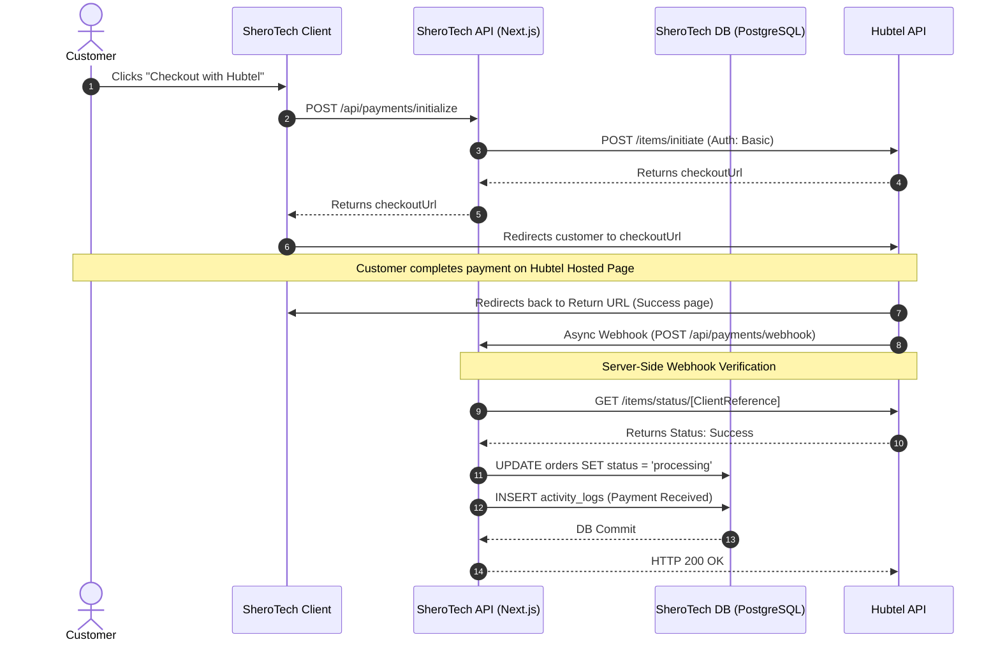

# Hubtel UAT Deliverables

This document contains the required deliverables for your Hubtel UAT (User Acceptance Testing) submission. You can copy these details directly or export this document to PDF to send to your Hubtel integration manager.

## 1. Meeting Schedule
*Please fill in your preferred availability for the UAT sign-off meeting.*
- **Proposed Date/Time 1:** [e.g., Wednesday, July 2nd, 10:00 AM GMT]
- **Proposed Date/Time 2:** [e.g., Thursday, July 3rd, 2:00 PM GMT]

## 2. Sample Webhook Callback
Below is a sample JSON payload demonstrating how our application expects to receive and process successful payment webhooks from Hubtel at our endpoint `POST https://shop.sherohq.com/api/payments/webhook`.

```json
{
  "TransactionId": "6fdb2910-333e-4861-ab3b-c2e74d1565a9",
  "ClientReference": "ORD-A1B2C3D4",
  "Amount": 100.50,
  "Status": "Success",
  "PaymentMethod": "Mobile Money",
  "CustomerName": "John Doe",
  "CustomerMsisdn": "233541234567",
  "Description": "Order ORD-A1B2C3D4",
  "Timestamp": "2026-06-30T10:00:00Z",
  "ResponseCode": "0000",
  "ResponseMessage": "Transaction successful"
}
```

## 3. Sample Status Check Response
As a security best practice, our application does not blindly trust webhooks. Upon receiving a webhook, our server verifies the transaction status by making a `GET` request to Hubtel's status endpoint (`/items/status/{ClientReference}`). 

Below is the expected successful response we process to finalize the order in our database:

```json
{
  "responseCode": "0000",
  "message": "Success",
  "data": {
    "transactionId": "6fdb2910-333e-4861-ab3b-c2e74d1565a9",
    "clientReference": "ORD-A1B2C3D4",
    "amount": 100.50,
    "status": "Success",
    "paymentMethod": "Mobile Money"
  }
}
```

## 4. Live App URL
Our application is fully deployed and ready for live testing.
- **Production URL:** [https://shop.sherohq.com](https://shop.sherohq.com)

## 5. Integration Flow Diagram
The following sequence diagram outlines our end-to-end integration architecture with Hubtel's Online Checkout, including server-side webhook verification.


