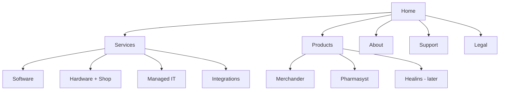
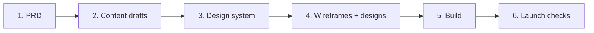

# SHERO Website Redesign — PRD

Sep 24, 2026 · @sherohq

## Overview

sherohq.com will be rebuilt as SHERO's master-brand home: clear about what SHERO sells today, honest about what it is building, and written in the voice the Company playbook defines.

SHERO is a Tamale-based technology company that builds its own products and builds for people, businesses, organizations and communities. Today it sells hardware (through the online shop), custom software, managed IT, and systems and API integration. Its own products, Merchander, Pharmasyst and Healins, are all unreleased.

The current site has five problems this redesign fixes:

- It presents SHERO as an electronics store plus IT agency; SHERO's own products are invisible.
- It makes claims that are not true yet: 24/7 support and 99.99% uptime (hours are Mon–Fri, 8:00–18:00), a live health-authority integration in the Pharmasyst mockup, and client-like demo dashboards.
- It has empty proof sections: Client Voices has no testimonials, and the portfolio has filters but no projects.
- Its messaging repeats "expand / redefine what's possible" in nearly every section, which fails the playbook's own voice test.
- Small inconsistencies: SEO targets Accra though SHERO is in Tamale, and Consultation overlaps with Contact.

## Goals and non-goals

### Goals

1. A visitor understands within 10 seconds what SHERO does and what they can get from it today.
2. Both sides of SHERO are visible: what it builds for others, and its own products.
3. Every claim on the site is true on launch day.
4. The live offers keep converting: consultation bookings and shop orders.
5. Unreleased products collect interest through waitlists instead of looking finished.
6. The site can grow into the master-brand structure (future divisions) without a rebuild.

### Non-goals

- Not building full product landing pages for Merchander, Pharmasyst or Healins; each gets one page on sherohq.com until launch.
- Not creating pages for divisions that are not active (SHERO Health, Finance, Education, Infrastructure, Foundation).
- Not redesigning the shop's checkout or payment flow in this phase, unless the design system work forces visual updates.
- Not changing the Meta verification sentence in the footer.

## Audiences

The playbook names four audiences; the site serves them through three main paths: buy hardware, get something built or managed, and follow SHERO's products.

| Audience | What they come for | What the site must give them | Main action |
| --- | --- | --- | --- |
| People (individuals) | Laptops, phones, accessories | Trustworthy products, clear prices, delivery and payment options (MoMo, Telecel Cash, card, cash on delivery) | Shop order |
| Businesses | Software, hardware for staff, IT setup and support | What SHERO can do, how it works, what it costs to start a conversation | Book a consultation |
| Organizations | Larger systems, integrations, managed infrastructure | Capability, process, and proof of past work | Book a consultation |
| Communities | Access, education, partnership | Why SHERO exists and how to partner | Contact |
| Early adopters (merchants, pharmacies, health users) | SHERO's own products | Honest status and what each product will do | Join waitlist |

Partners and future investors also read the About page; it should explain the long-term direction in one short section.

## Sitemap and page requirements

The site has six areas; Home leads with what SHERO sells today, then what it is building.

| Page | Must do | Must include |
| --- | --- | --- |
| Home | Explain SHERO in one plain line; route visitors to shop, services or products | Hero, services overview, shop highlights, "What we're building" (status-labelled), the belief in one line, contact call to action |
| Services | Show each service with what it covers and how engagement works | Software, Hardware, Managed IT, Integrations; the 6-step process; real hours |
| Hardware + Shop | Sell hardware | Existing shop (refurbished devices, with testing and warranty terms stated), categories, delivery terms (free over GHS 2,000), payment methods |
| Product pages | Show status and collect interest | Shared content structure (see next section) |
| About | Tell the story, values and direction | Story, 4 core values, one short section on long-term direction; no division pages |
| Support | Get people help or a conversation | FAQ, contact, track order, consultation booking (Consultation and Contact merged) |
| Legal | Terms, privacy, cookies | Footer carries the Meta sentence verbatim |

A Work section shows real client projects, each with the client's permission: TrustCircle (completed, for Samakose), Tastea and Dajrim. Testimonials appear only when real ones exist.

## Product pages

Each product gets one page on sherohq.com with a shared content structure and its own visual identity; its subdomain redirects there until launch.

**Shared content structure (same for every product):**

1. Name and status label (In development / In validation)
2. The problem, in plain words
3. Who it is for
4. What it will do (3–4 points)
5. Waitlist or early-access form

**Per-product identity (different for every product):** logo, colours, typography and imagery. One layout with swappable theming, so it is one build, not three.

| Product | Status | Page | Subdomain | Identity |
| --- | --- | --- | --- | --- |
| Merchander | In development | sherohq.com/merchander | merchander.sherohq.com → redirect | Merchander logo; tagline "Open Path. More Possibilities." |
| Pharmasyst | In development (v2 rebuild) | sherohq.com/pharmasyst | pharmasyst.sherohq.com → redirect (replaces broken v1) | Green #13A56B, indigo #3D3FB8, split-capsule mark |
| Healins | In validation | Added later | Decided later | Set after positioning work |

At launch, a product's subdomain stops redirecting and becomes its app or full landing page.

## Content and voice rules

All copy follows the playbook's Tone & Voice page: clear, human, confident, thoughtful, optimistic; never corporate, buzzword-heavy or overly promotional.

**Honesty rules (from the "no bold claims" principle):**

- Every number and promise is true on launch day. Support hours match reality (Mon–Fri, 8:00–18:00) unless 24/7 support actually exists.
- No uptime figures, certifications or integrations that are not live.
- Mockups of unreleased products are labelled as previews, never shown as live systems or real clients.
- No brand logo strip: SHERO is not an authorised reseller, so brands are named only as the device brand in product listings. Hardware is described as refurbished and quality-checked, never as "authentic" or from "authorised supplier channels".
- No empty sections waiting for content.

**Writing rules:**

- The belief ("technology exists to expand what's possible") appears once or twice, not in every section.
- Lead with people and outcomes, then the technology.
- Content is written before layouts are designed; no placeholder text in designs.

## Constraints and fixed requirements

These carry over unchanged or must be handled at launch.

- **Meta footer line:** "SHERO HQ is a brand of SHERO FINTECH" stays in the footer, word for word, as Meta requested. It is styled as small legal print near the copyright line.
- **Shop:** cart, wishlist and order tracking stay; customer accounts and login are removed. Checkout is guest-only, and payment is MoMo (MTN MoMo or Telecel Cash), card (Visa or Mastercard) or cash on delivery.
- **Redirects:** product subdomains redirect to their sherohq.com pages; pharmasyst.sherohq.com stops serving v1.
- **Existing URLs:** old paths (/consultation, /contact-us, /products, /partners, /careers) redirect to their new homes so links and search rankings are not lost.
- **SEO:** location keywords say Tamale, not Accra; keep "refurbished laptops" and state it plainly on the shop; drop "authorised sourcing" language.
- **Contact details:** hello@sherohq.com, +233 54 871 1582, Tamale, Ghana.
- **Theme:** keep light and dark mode support.
- **Mobile first:** most visitors will arrive from phones and social links.

## Success measures

Success is measured by actions taken, not visits; targets are set after launch. Baseline: the current site has had zero shop sales and low traffic.

| Measure | What it shows | Target |
| --- | --- | --- |
| Consultation bookings per month | Services demand | Set after baseline |
| Shop orders per month | Hardware sales | Set after baseline |
| Waitlist signups per product | Product interest; pilot pipeline | Set after baseline |
| Claims review passed at launch | Honesty rules met | 100% of claims true |
| Mobile page load | Usability on phones | Under 3 seconds on 4G |

Analytics must be in place at launch so these can be tracked.

## Decisions since the first draft

These came out of the content and design rounds and override anything above that says otherwise.

### Brand and design

- Motto: **Redefine Possible**. It appears in the homepage hero, on About and in the footer only, never in section headings.
- The logo stays exactly as it is; its navy #043284 and emerald #05735A are fixed brand inks.
- New design system, "SHERO — Master Brand": Red Hat Display, Text and Mono; navy as ink, emerald as a sparing accent; nearly square corners.
- The logo's slanted S bars are used sparingly: only in the homepage hero, the About hero and the 404. Everything else uses quiet structure (hairlines, plain labels, simple dots on timelines), and headline sizes stay as designed.
- The site follows each visitor's system setting; light and dark are both fully designed.
- Balance is about 70% human, 30% spec sheet: one data moment per page (stock list, device check, service readouts). SHERO is faceless: no founder or team photos, and no copy claiming a team. Imagery is client-work screenshots, labelled dashboard previews for unreleased products, and product photos of devices.
- Removed template tropes: dot grids, gradient text, pill badges, orbit graphics, brand logo strip.

### Homepage

- Hero: the motto on the left, "What do you need?" on the right with four paths: I need a laptop → Shop; I need software built → Custom software; I sell on social media → Merchander waitlist; I run a pharmacy → Pharmasyst waitlist.
- Managed IT is not a homepage path (no business demand yet); it stays on Services, and "Something else? Book a free consultation" catches the rest.
- Client proof: Samakose, TrustCircle, Tastea and Dajrim logos replace the brand logo strip.

### Shop and checkout

- Header: no cart, search or wishlist on non-shop pages; the cart appears with a count once something is added; shop and product pages always show search, wishlist and cart.
- Every listing shows battery health, with an optional free-text note; the laptop detail page shows that device's own check results. There are no fixed "Good for" categories: a prompt at the top of the shop invites buyers to say what the laptop is for on WhatsApp, and SHERO recommends one.
- No customer accounts. Orders are tracked with order number plus phone number.
- Checkout asks for an optional referral: the referrer's phone number, thanked with a token once the order is delivered.
- Free nationwide delivery over GHS 2,000 is kept as a deliberate customer-acquisition cost.

### Messaging: WhatsApp in two phases

- **Phase 1, at launch:** no WhatsApp API and no Meta charges. "Ask about this laptop", Consultation, Tech help and Support open WhatsApp click-to-chat links; the team replies from the WhatsApp Business app; order confirmation and delivery updates are sent by hand from the app.
- **Phase 2, when order volume justifies it:** WhatsApp Cloud API bot for order updates and FAQs, with a human handoff to an inbox in SHERO's dashboard.
- Reason: from 1 October 2026 Meta charges for service replies and in-window utility messages on the API; the Business app stays free.

### Referrals and privacy

- A referrer's number is used to thank them. It is kept only if they agree when contacted (building a consented list of people who trusted SHERO); otherwise it is deleted and only a referral count is kept.

### Pages designed (desktop and mobile, light and dark)

Home, Services, Shop, Laptop detail, Cart, Checkout, Track order, Merchander, Pharmasyst, Work, Case study (TrustCircle as template), About, Support, Consultation, Careers, Privacy (layout for Terms and Cookies), 404, and the mobile menu. Designs live on the "SHERO Website" canvas.

## Order of work and open questions

Work runs in six steps; content comes before design so layouts fit real words. Status: steps 1–4 are done; step 5, the build, is next.

Design-system foundations (colour, type) can start alongside the content drafts; components and layouts wait for the copy.

**Open questions**

- [ ] One-line descriptions, problem, what was built, result and screenshots for TrustCircle, Tastea and Dajrim
- [ ] Resolved: no fixed "Good for" categories; recommendations happen on WhatsApp (Grade A++ minimum battery health is decided: 90%, batteries are usually replaced with original batteries at 100%, and listings say so)
- [ ] Images: device photos for each listing, client-work screenshots, and dashboard previews for Merchander and Pharmasyst (SHERO is faceless: no team or founder photos)
- [ ] Resolved: referral thank-yous vary, so the site promises a thank-you after delivery but never a specific reward
- [ ] Privacy page: a lawyer's review (payments run through Hubtel and Paystack) (retention periods are agreed; see the Admin Dashboard Scope)
- [ ] Resolved: the old bot used a different number, so +233 54 871 1582 is free to run on the WhatsApp Business app for Phase 1
- [ ] Move hosting to a commercial plan before launch or at the first sale

**Decided**

- SHERO is not an authorised reseller; the brand logo strip is removed.
- The shop sells refurbished devices for now: Grade A++, 90%+ cosmetic condition, one-week warranty.
- Publishable work: TrustCircle, Tastea, Dajrim — all completed and in production, permissions granted. Business Doctor is not shown.
- The website stays out of the "shero" monorepo; it is far simpler than Merchander and the coming apps. Payments work the same way but are built separately.
- Analytics: Google Analytics with key events (bookings, orders, waitlist signups) plus Microsoft Clarity; cookie notice required.
- Hosting stays on Vercel Hobby while nothing generates revenue.
- Healins is on hold for the website.
